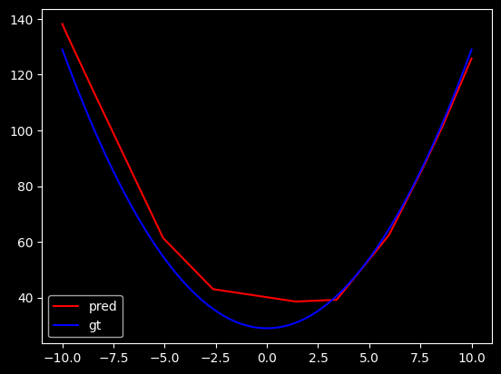

# Chap4 函数拟合报告

## 1. 任务概述

本实验使用 **NumPy 手写两层全连接神经网络**，完成 `chap4` 中的函数拟合任务。模型以 ReLU 为隐层激活函数，通过最小化均方误差来学习目标函数。

说明：当前保存的 notebook 只保留了训练与可视化部分，函数定义和采样预处理单元未完整保存在源码中。以下内容依据现有代码、训练日志和可视化结果整理。

## 2. 函数定义

结合当前 notebook 中的可视化切片

```python
test_x = np.array([[4, 3, 2, x] for x in x_dim3])
```

以及真值曲线形状，可以将当前实验对应的目标函数写为：

\[
f(x_1,x_2,x_3,x_4)=x_1^2+x_2^2+x_3^2+x_4^2
\]

当固定前三维为 `(4, 3, 2)` 时，有：

\[
f(4,3,2,x)=4^2+3^2+2^2+x^2=29+x^2
\]

这与图中的蓝色真值曲线一致。

## 3. 数据采集

- 输入为 4 维向量；
- `utils.py` 中的采样函数默认在区间 `[-10, 10]` 上对每一维做均匀随机采样；
- `utils.py` 中默认按 `8:2` 划分训练集和测试集；
- 从 notebook 中的 `x_mean / x_std / y_mean / y_std` 可以看出，训练时对数据做了标准化，并在可视化时进行了反标准化。

## 4. 模型描述

- 网络结构：`4 -> 60 -> 1`；
- 隐层激活函数：ReLU；
- 输出层：线性输出；
- 损失函数：均方误差（MSE）；
- 训练方式：手动反向传播更新参数；
- 训练轮数：`1000`；
- 学习率：`0.1`。

对应实现文件：

- `chap4_ simple neural network/simple_fnn.py`
- `chap4_ simple neural network/utils.py`
- `chap4_ simple neural network/myfuncion_fnn-numpy.ipynb`

## 5. 拟合效果

训练日志显示，模型收敛较稳定：

- 测试集损失：`0.018960369811141943`
- 测试集分数：`0.9817900844942352`

其中 `score` 按代码实现等价于决定系数 `R²`，说明模型已经较好地拟合了目标函数。可视化结果也表明：

- 预测曲线整体趋势与真实曲线一致；
- 在区间两端拟合较好；
- 在函数最低点附近存在轻微误差，这是 ReLU 分段线性逼近带来的正常现象。



## 6. 结论

本实验使用 NumPy 成功实现了基于 ReLU 的前馈神经网络，并完成了对自定义函数的拟合。模型结构简单、训练稳定，最终在测试集上取得了较好的拟合效果，
